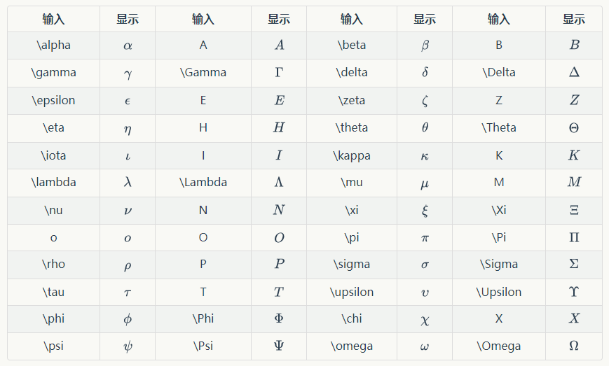
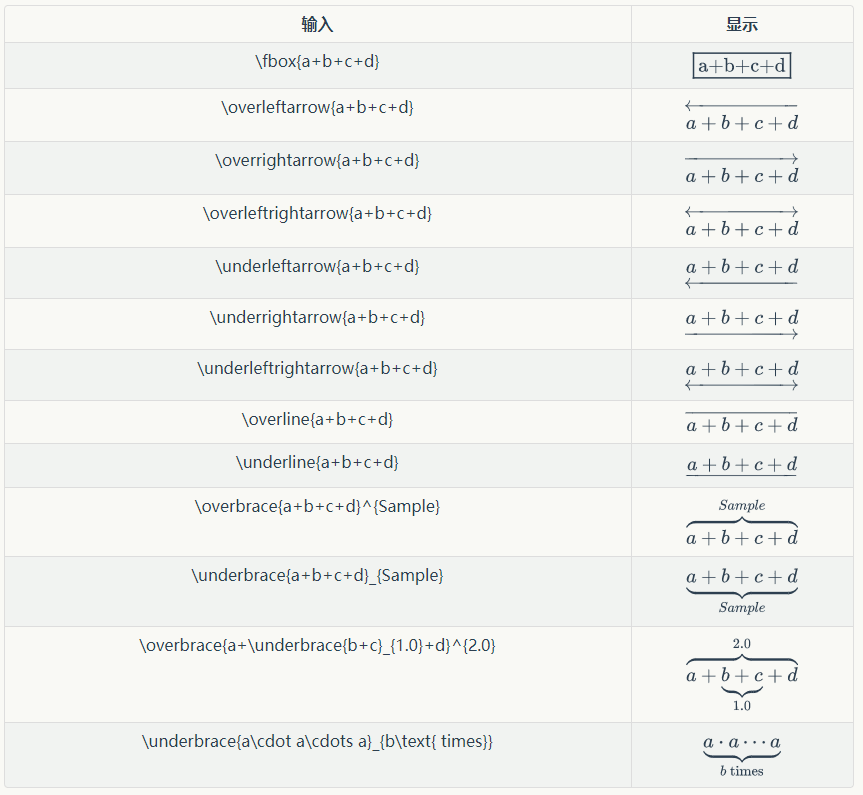
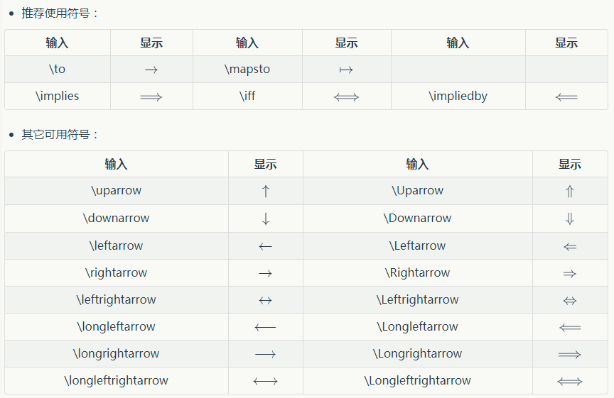

# Markdown 中的 Latex 公式

Latex 是一种基于 TEX 的排版系统，由美国计算机科学家 Leslie Lamport 在 20 世纪 80 年代初期开发，利用这种格式，即使使用者没有排版和程序设计的只是也可以充分发挥由 Tex 提供的强大功能。在生成复杂表格和数学公式表现地尤为突出，非常适用于生成高印刷质量的科技和数学类文档。

Markdown 通过扩展，可以提供对 Latex 的支持。

## 行间公式和行内公式

Latex 中的公式可以分为行内公式和行间公式两种。

**行内公式**是将数学式插入文本行之内，使之与文本融为一体，这种形式适合编写简短的数学式。基本语法为 `$ ... $`。

**行间公式**是将数学式插入在文本行之间，自行一行或一个段落，与上下文附加一段垂直空白，使数学式突出醒目。基本语法为 `$$ ... $$`。

## 基本语法

### 上下标

`^` 表示上标，`_` 表示下标。如果上下标的内容多于一个字符，要用大括号 `{}` 把这些内容括起来当做一个整体。上下标是可以嵌套的，也可以同时使用。

```$$ e ^ {\pi i} + 1 = 0 $$```

另外，如果要在左右两边都有上下标，可以用 `\sideset` 命令。

```$$ \sideset{^1_2}{^3_4}\bigotimes $$```

### 分数

分数的输入形式为 `\frac{numerator}{denominator}`。

```$$ \frac{3}{10} = 0.3 $$```

便捷情况可直接输入 `\frac ab` 来快速生成 $ \frac ab $。
如果分式很复杂，也可以使用 `numerator \over denominator` 命令。

```$$ {a + 1 \over b + 1} $$```


### 上下划线和箭头符号

```
$$ \overline{a + b +c} $$
$$ \underline{a + b + c} $$
$$ \overleftarrow{a + b} $$
$$ \underleftarrow{a + b} $$
$$ \underleftrightarrow{a + b} $$
$$ \vec a \cdot \vec b = 0 $$
```

### 花括号

```
$$ \overbrace {a + b} ^ \text{a, b} $$
$$ \{ $$
$$ \} $$
```

### 根号

根号的输入形式为 `\sqrt[root]{arg}`，`root` 默认是 2。

```
$$ \sqrt[2]{4} $$
```

### 输入括号和分隔符

`()`、`[]`、`|` 分别表示原尺寸的形状，当需要显示大号的括号或分隔符时，要用 `\left` 和 `\right` 命令。如果你需要在不同的行显示对应括号，可以在每一行对应处使用 `\left.` 和 `\right.` 来放一个影子括号。

```$$ f(x, y, z) = 3y^2z \left(3 + \frac{7x + 5}{1 + y^2} \right) $$```

还有一些特殊的括号：


### 省略号

数学公式中常见的省略号有两种， `\ldots` 表示与文本底线对齐的省略号，`\cdots` 表示与文本中线对齐的省略号。同时 `ldot` 和 `cdot` 表示单个点的版本。

```$$ f(x_1, x_2, \ldots, x_n) = x_1^2 + x _2^2 + \cdots + x_n^2 $$```

### 积分符号

使用 `\int` 来输入一个积分符号。

```$$ \int_0^1 x^2 \, {\rm d}x $$```

### 极限符号

使用 `\lim_{n \to limit}` 来输入一个极限符号。

```$$ \lim_{n \to +\infty} \frac{1}{n(n + 1)} $$```

### 累加、累乘运算

使用 `\sum_{i=1}^n` 来输入一个累加，类似的也可以通过 `\prod`、`\bigcup`、`\bigcap` 来分别输入累乘、并集和交集。

```$$ \sum_{i=1}^n \frac{1}{i^2} $$```

```$$ \prod_{i=1}^n \frac{1}{i^2} $$```

### 输入希腊字母

输入 `\fullname` 和 `\CapFullName` 来分别输入小写和大写希腊字母。对于大写希腊字母与现有字母相同的，直接输入大写字母即可。



部分字母有变量专用形式，以 `\var` 开头。


### 关系运算符


### 集合运算符


### 对数运算符


### 三角运算符


### 微积分运算符


### 逻辑运算符


### 戴帽符号


### 连线符号



### 箭头符号



### 字体转换

若要对公式的某一部分字符进行字体转换，可以使用 `{\fontname {chars}}` 来进行转换。一般情况下，默认为意大利体，即斜体。


### 其他命令

#### 添加注释

通过 `\text {comment}` 添加注释文字。

#### 在字符间加入空格

有四种宽度的空格可以使用： `\`,、`\;`、`\quad` 和 `\qquad`。

```$$ a \, b \mid a \; b \mid a \quad b \mid a \qquad b $$```

#### 更改文字颜色

使用 `\color{color}{text}` 来更改特定文字的颜色，其中颜色支持语义描述和 RGB 值。

#### 添加删除线

使用 `\cancel{chars}`、`\bcancel{chars}`、`\xcancel{chars}` 和 `\cancelto{chars}` 来声明不同类型的删除线效果。其他的删除线效果有 horizontalstrike、verticalstrike、updiagonalstrike 和 downdiagonalstrike，可叠加使用。

## 矩阵

在开头使用 `begin{matrix}`，在结尾使用 `end{matrix}`，在中间插入矩阵元素，每个元素之间插入 `&`，并在每行结尾处使用 `\\`。

```
$$ 
\begin{matrix}
1 & x & x^2 \\
1 & y & y^2 \\
1 & z & z^2 \\
\end{matrix}
$$
```

### 边框矩阵

在开头和结尾将 `matrix` 替换为 `pmatrix`、`bmatrix`、`Bmatrix`、`vmatrix` 和 `Vmatrix`。


### 输入带省略号的矩阵

使用 `\cdots`，`\ddots`，`\vdots` 来输入省略符号。

```
$$
\begin{pmatrix}
1 & a_1 & a_1^2 & \cdots & a_1^n \\
1 & a_2 & a_2^2 & \cdots & a_2^n \\
\vdots & \vdots & \vdots & \ddots & \vdots \\
1 & a_m & a_m^2 & \cdots & a_m^n
\end{pmatrix}
$$
```

### 带分割符号的矩阵

`cc|c` 代表在一个三列矩阵中的第二和第三列之间插入分割线。

```
$$
\left[
    \begin{array}{cc|c}
      1&2&3\\
      4&5&6
    \end{array}
\right]
$$
```

### 输入行内矩阵

若想在一行内显示矩阵，使用 `\bigl(\begin{smallmatrix} ... \end{smallmatrix}\bigr)`。

## 条件表达式

使用 `begin{cases}` 来创造一组条件表达式，在每一行条件中插入 `&` 来指定需要对齐的内容，并在每一行结尾处使用 `\\`，以 `end{cases}` 结束。

```
$$
f(n) =
\begin{cases}
n/2,  & \text{if $n$ is even} \\
3n+1, & \text{if $n$ is odd}
\end{cases}
$$
```

### 适配行高

在一些情况下，条件表达式中某些行的行高为非标准高度，此时使用 `\\[Nex]` 语句代替该行末尾的 `\\` 来让编辑器适配。

```
$$
f(n) = 
\begin{cases}
\frac{n}{2},  & \text{if $n$ is even} \\[2ex]
3n+1, & \text{if $n$ is odd}
\end{cases}
$$
```

## 数组和表格

数组和表格均以 `begin{array}` 开头，并在其后定义列数及每一列的文本对齐属性，`c`、`l`、`r` 分别代表居中、左对齐及右对齐。若需要插入垂直分割线，在定义式中插入 `|` ，若要插入水平分割线，在下一行输入前插入 `\hline` 。与矩阵相似，每行元素间均须要插入 `&` ，每行元素以 `\\` 结尾，最后以 `end{array}` 结束数组。 

```
$$
\begin{array}{c|lcr}
n & \text{左对齐} & \text{居中对齐} & \text{右对齐} \\
\hline
1 & 0.24 & 1 & 125 \\
2 & -1 & 189 & -8 \\
3 & -20 & 2000 & 1+10i
\end{array}
$$
```

### 输入一个方程组

使用 `\begin{array}…\end{array}` 和 `\left\{…\right.` 来创建一个方程组。

```
$$
\left\{ 
\begin{array}{c}
a_1x+b_1y+c_1z=d_1 \\ 
a_2x+b_2y+c_2z=d_2 \\ 
a_3x+b_3y+c_3z=d_3
\end{array}
\right. 
$$
```

或者使用条件表达式组 `\begin{cases}…\end{cases}` 来实现相同效果：

```
$$
\begin{cases}
a_1x+b_1y+c_1z=d_1 \\ 
a_2x+b_2y+c_2z=d_2 \\ 
a_3x+b_3y+c_3z=d_3
\end{cases}
$$
```

## 参考资料

- [Markdown 公式指导手册](https://www.zybuluo.com/codeep/note/163962#1如何插入公式)
- [Markdown 在线编辑器](https://www.zybuluo.com/mdeditor)