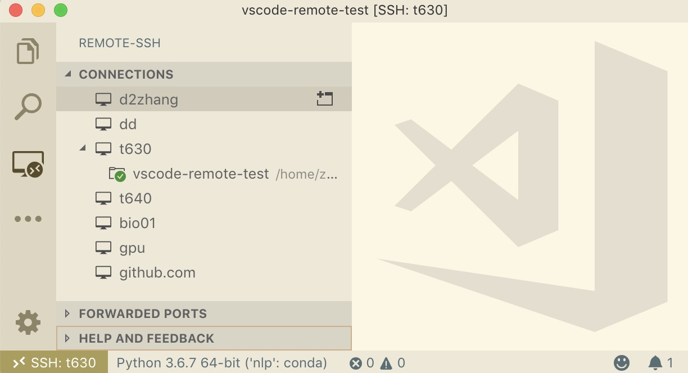
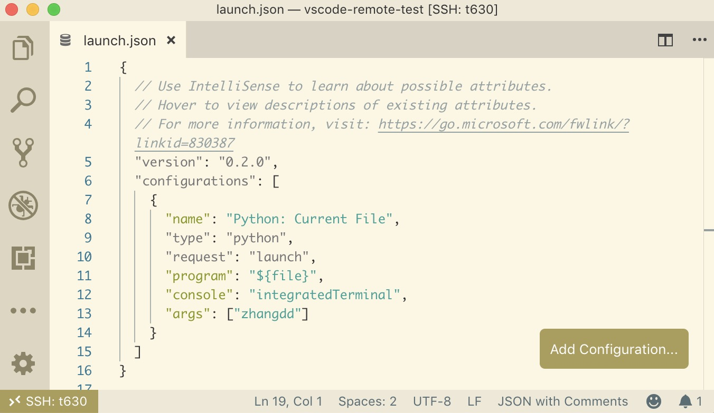
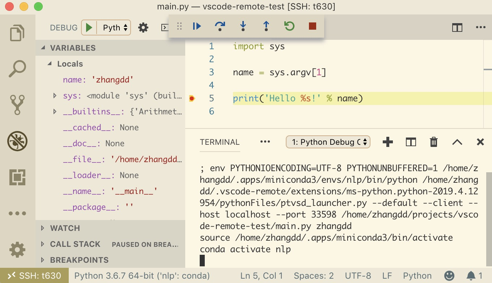

# VS Code 重新定义远程开发

近日，[VS Code 团队发布了远程开发套件](https://marketplace.visualstudio.com/items?itemName=ms-vscode-remote.vscode-remote-extensionpack)（Remote Development Extension Pack），主要包含 3 个扩展，分别支持**容器**、**远程机器**以及 **Windows 的 Linux 子系统**上的远程开发。

在体验了一把 VS Code 远程开发套件之后，简直被感动到不要不要的，堪称卓越，这才是我真正想要的解决方案呀！VS Code Stable 和 VS Code Insiders 均已支持此扩展。

## 远程开发之痛

这是大数据的时代，虽然个人主机性能已经很强劲，但我们还是要依托高性能的服务器来完成一些计算。经历过远程开发的人都知道，即使有一些远程开发工具的帮助，远程开发仍然是一件非常繁琐且头疼的事情。

先来看看目前常用的远程开发解决方案：

- 远程桌面：比如微软的远程桌面、VNC 或者 [Teamviewer](https://www.teamviewer.com/cn/) 等工具，界面看起来最理想。但在一些 Linux 系统上并不容易搭建，且由于数据传输的问题，使用起来总是“卡卡的”
- SSH 远程操作：对于无界面服务器是最常用的手段，但缺少可视化操作界面，开发效率低下，不利于调试
- 基于浏览器的工具：此类工具非常之多，功能和缺陷完全取决于开发者的目的与实现，例如 [cloudcmd](http://cloudcmd.io/)、[Jupyter Notebook](https://jupyter.org/) 等
- 特定软件：以 [JetBrains Pycharm](https://www.jetbrains.com/pycharm/) 为例，其实是支持远程 Python 开发的，但软件体量大，且需要保持代码同步

## VS Code 远程开发套件

VS Code 远程开发套件在本地和远程都运行着 VS Code 的实例，保证在远程环境中拥有本地的开发体验，真正做到了无缝的远程开发。


具体来说，远程开发套件共分为 3 部分：

- [Remote SSH](https://marketplace.visualstudio.com/items?itemName=ms-vscode-remote.remote-ssh)：基于 SSH 连接远程主机，以使用远程主机提供的高性能
- [Remote WSL](https://marketplace.visualstudio.com/items?itemName=ms-vscode-remote.remote-wsl)：利用 Windows 的 Linux 子系统进行开发
- [Remote Container](https://marketplace.visualstudio.com/items?itemName=ms-vscode-remote.remote-containers)：利用 Docker 容器作为开发环境

## 初次上手

本部分将使用 Remote SSH 扩展，通过私钥连接远程主机，并进行 Python 代码的开发与调试。

### 机器准备

1. 本机：
   - MacBook Pro: MacOS v10.14
   - VS Code: v1.38.0
   - Remote Development Extension Pack: v0.12.0
2. 远程主机
   - Name: gpu
   - Linux: Centos 7
   - SSH: zhangdd@172.168.1.16:22

### 配置连接信息

在开始之前，需要在本机配置连接信息。Remote SSH 可以使用 SSH 默认的[配置文件](https://linux.die.net/man/5/ssh_config)，也可以在 VS Code 中使用自定义的配置。

例如，在 `~/.ssh/config` 文件中写入：

```
Host gpu
    Hostname 172.168.1.16
    User zhangdd
```

### 连接

1. 从 VS Code 左侧 "Activity Bar" 面板查看 "Remote-SSH" 的连接信息。如果无法显示，应检查配置**文件格式**及**文件权限**
   
2. 选中需要连接的服务器并确认，接着右键连接，或点击右边的连接按钮
3. 连接成功后选择 "Open folder..."，接着选择远程主机用户目录下的项目并选择打开即可。如果连接失败，需检查网络连接
4. 这样，就可以看到本机的 VS Code 成功连接到远程主机了，而且文件、搜索、Git、调试、终端都能完美集成，所有的操作实际上都是在远程主机上的

> 之前连接过的项目都会被保存，方便以后快速连接。

### Python 代码调试

1. 为了提供 Python 调试的功能，我们需要在 VS Code 扩展面板为**远程**安装 [Python 扩展](https://marketplace.visualstudio.com/items?itemName=ms-python.python)
2. 为项目选择合适的 Python 解释器，并安装 `pylint` 之类的工具
3. 打开调试面板，添加配置时选择 "Python File"，在自动打开的 `launch.json` 文件中配置调试信息
    
4. 回到需要调试的文件并添加断点，按 F5 键开始调试
    

## 总结

VS Code 远程开发套件可谓是神器，也相信接下来会优化地更好，不愧是宇宙最强编辑器！

## 参考资料

- [Remote Development with VS Code](https://code.visualstudio.com/blogs/2019/05/02/remote-development)
- [Remote Development using SSH](https://code.visualstudio.com/docs/remote/ssh)
- [VS Code Insiders](https://code.visualstudio.com/insiders/)
- [Debugging configurations for Python apps in Visual Studio Code](https://code.visualstudio.com/docs/python/debugging)
