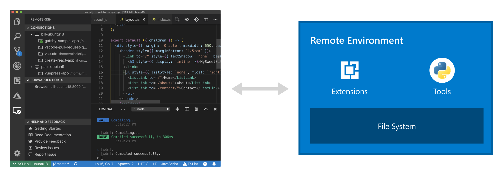

# VSCode 重新定义远程开发

## VSCode 远程开发

最近，VSCode 在 Insiders 版本中推出了支持远程开发的套件，它允许你可以使用容器、远程机器以及 WSL 作为开发环境，而且不需要你在本机上有源代码，真正提供了高易用性的远程开发体验。



## 为什么这么推崇它？

在我看来，VSCode 在 Insiders 版本中最新推出的 Remote Development 扩展套件真的是近乎完美的远程开发解决方案了。之前由于远程开发工作的需要，也尝试过很多所谓的解决方案，但都完全达不到一个懒惰的程序员对易用性的要求。

以下是一些尝试过的方法：

1. SSH：直接登录远程，然后你需要熟悉 Linux 常用的操作命令，在终端中修改源代码和查看你的结果
2. VSCode + SFTP：基本能够做到可视化查看和修改文件，但很难做到调试和集成远程终端
3. JetBrains 系列软件：这系列的软件基本能够提供远程开发和调试的功能，但是代码需要保持本地和远程同步
4. VSCode + RMate：支持在本地编辑远程文件，存在的问题和 SFTP 差不多

## 初次上手

此部分以 SSH + 远程机器的方法实现的远程开发为主，首先你需要保证：

- 本机安装 **VSCode Insiders**，并安装 **Remote Development** 开发套件扩展
- 一台可以通过 SSH 连接的远程机器

1. 在本机上配置远程主机的连接信息，你使用 `~/.ssh/config`，也可以使用 VSCode 的配置文件。以 `~/.ssh/config` 为例：

```
Host gpu
    Hostname 172.168.1.16
    User zhangdd
```

2. 在 VSCode Insiders 的命令面板中执行命令 `> Remote-SSH: Connect to Host...`（如果无法找到此选项，需要检查远程开发扩展是否安装成功），接着选择在上一步中配置的服务器（即 `gpu`）。在连接成功之后，会呈现出远程服务器的目录，选择你的项目目录即可
3. 打开项目之后，本地窗口就是你的远程项目了，而且几乎所有的操作都像和在本地操作一样，文件、搜索、Git、调试、终端都能完美集成，堪称无缝体验
